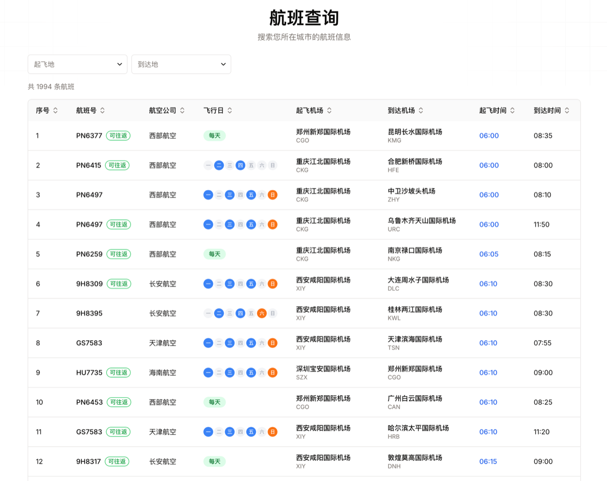

# 海航随心飞助手

> 中国国内航班数据查询与路线规划工具，针对"海航随心飞"使用场景优化的航线搜索助手。




---

## ⚠️ 免责声明

本项目为第三方个人开发者作品，**与海南航空股份有限公司、海航集团及其关联公司无任何隶属、合作、授权或背书关系**。"海航""随心飞"等相关名称与产品名为其各自合法持有人的商标或品牌，本项目仅为描述使用场景而引用，所有相关权益归原权利人所有。

本项目中的航班数据为**历史快照**，由作者整理自海航官方公开发布的航班计划，**非实时、非官方、不保证准确性**，仅供学习交流与个人参考。**严禁将本项目数据用于任何商业决策、出行决策或其他需要准确性保障的场景**。因使用本项目产生的任何后果，作者不承担任何责任。详细的数据说明、字段定义与许可拆分见 [DATA.md](./DATA.md)。

---

- 🔗 **在线体验**：https://sxfroute.com
- 📦 **Docker 镜像**：`ghcr.io/yixinmeng/sxfroute:latest`
- 🇺🇸 **English**：[README.en.md](./README.en.md)

## ✨ 功能特性

- **航班搜索**：支持单程 / 往返搜索，智能筛选夜航和凌晨航班
- **航线地图**：基于高德地图 JS API 的航线可视化
- **航班数据表**：全量航班历史快照浏览，支持筛选、排序
- **航班统计**：按出港城市、机场维度的统计面板
- **中英双语**：基于 `next-intl` 的中英界面切换

## 🚀 快速开始

### 前置要求

- **Node.js 18+**（推荐 20 LTS）
- **pnpm**（推荐 8+）：`npm install -g pnpm`
- **高德地图 JS API Key**（免费申请，见下文）

### 方式 1：Docker 一键启动（推荐）

> 📦 镜像同时支持 **linux/amd64**（Intel / AMD）和 **linux/arm64**（Apple Silicon M1/M2/M3/M4、Raspberry Pi 5、AWS Graviton），Docker 会自动拉取对应架构的变种。

#### 路径 A：docker-compose（推荐）

适合大多数人。自动从 GHCR 拉取镜像、自动挂载航班数据 volume、自动配置健康检查。

```bash
# 1. 克隆仓库（仓库里包含 docker-compose.yml、.env.example、默认航班数据 data/airport.csv）
git clone https://github.com/yixinmeng/sxfroute.git
cd sxfroute

# 2. 配置环境变量（推荐填高德 key；不填地图功能会优雅降级，其他功能正常）
cp .env.example .env
# 用任何编辑器打开 .env 填入你自己的高德 key（申请方式见下文）

# 3. 启动（首次会从 GHCR 拉取镜像，几秒到几十秒）
docker compose up -d
```

访问 <http://localhost:3000> 即可。

> 💡 修改 `data/airport.csv` 后**无需重启容器**，下一次请求就生效（基于 mtime 热更新，详见 [DATA.md](./DATA.md)）。

停止：`docker compose down`。

#### 路径 B：直接 docker run（不想 clone 仓库时用）

适合只想跑一下试试、或者放在云服务器上跑。镜像内置默认航班数据，无需挂载任何文件。

```bash
docker run -d \
  --name sxfroute \
  -p 3000:3000 \
  -e NEXT_PUBLIC_AMAP_KEY=your-amap-key \
  -e NEXT_PUBLIC_AMAP_SECURITY_CODE=your-amap-jscode \
  --restart unless-stopped \
  ghcr.io/yixinmeng/sxfroute:latest
```

访问 <http://localhost:3000> 即可。如果不想配置高德 key，去掉那两行 `-e` 也能跑。

### 方式 2：本地开发

```bash
# 1. 克隆
git clone https://github.com/yixinmeng/sxfroute.git
cd sxfroute

# 2. 安装依赖
pnpm install

# 3. 配置环境变量
cp .env.example .env.local
# 编辑 .env.local 填入你自己的高德 key

# 4. 启动开发服务器
pnpm dev
```

访问 http://localhost:3000 。

## ⚙️ 环境变量

**所有变量都是可选的，不设也能跑。** 推荐配置高德地图相关两个，地图与城市搜索功能才能正常使用。

| 变量 | 推荐？ | 说明 | 不设的影响 |
|---|:---:|---|---|
| `NEXT_PUBLIC_AMAP_KEY` | ✅ 推荐 | 高德地图 JS API Key | 地图视图、城市搜索优雅降级；航班表 / 筛选 / 统计正常 |
| `NEXT_PUBLIC_AMAP_SECURITY_CODE` | ✅ 推荐 | 高德地图安全密钥 | 同上 |
| `NEXT_PUBLIC_WEB_URL` | ❌ 可选 | 公开站点 URL（仅 SEO 用） | sitemap 为空、canonical 走相对路径、JSON-LD 不输出。仅当你把这个项目作为**对外公开站点**部署时再设置 |

## 🗺️ 如何申请高德地图 Key（约 3 分钟）

1. 访问 https://console.amap.com/ 并使用手机号注册 / 登录
2. 左侧菜单：**应用管理 → 我的应用 → 创建新应用**
3. 应用名称任意填写，应用类型选 **"Web 端（JS API）"**
4. 记录生成的 **Key** 和 **JSCode**（安全密钥）
5. 在应用详情里添加 **域名白名单**：`localhost` + 你的生产域名
6. 把 Key 填入 `.env` 的 `NEXT_PUBLIC_AMAP_KEY`，JSCode 填入 `NEXT_PUBLIC_AMAP_SECURITY_CODE`

> 💡 高德 Web 端 JS API 提供 **免费配额**，个人使用通常足够。

## 🏗️ 技术栈

- **框架**：Next.js 14（App Router）
- **语言**：TypeScript
- **UI**：Tailwind CSS + shadcn/ui + Radix UI
- **地图**：高德地图 JS API（`@amap/amap-jsapi-loader`）
- **表格**：TanStack Table
- **国际化**：next-intl
- **主题**：next-themes
- **部署**：Docker 多阶段构建 + GitHub Actions 推送 GHCR

## 📂 项目结构

```
app/              # Next.js App Router 路由与 API
components/       # UI 组件（blocks / ui / icon）
lib/flight/       # 航班数据加载器与业务逻辑
services/         # 服务层（缓存、landing 内容）
providers/        # React context providers
i18n/             # next-intl 多语言文案
types/            # TypeScript 类型定义
public/           # 静态资源（favicon、logo、图片）
data/             # 航班数据 CSV（可热更新，详见 DATA.md）
```

## 📊 自定义航班数据（热更新）

航班数据存放在 `data/airport.csv`，作为运行时唯一数据源。你可以直接用文本编辑器或 Excel 修改这个文件，**无需重新构建镜像，也无需重启容器**，下一次 API 请求会基于文件 mtime 自动重新加载。

- **Docker Compose**：`docker-compose.yml` 已把宿主机 `./data` 以只读方式挂载到容器 `/app/data`，改完 `data/airport.csv` 后直接刷新页面即可生效。
- **docker run**：追加 `-v $(pwd)/data:/app/data:ro` 即可使用自定义数据；不加则使用镜像内置的默认数据。
- **本地开发**：`pnpm dev` 下直接改 `data/airport.csv`，同样即时生效。

字段格式与解析规则见 [DATA.md](./DATA.md)。

## 🤝 贡献

欢迎 Bug 修复 PR！请先阅读 [CONTRIBUTING.md](./CONTRIBUTING.md) 与 [CODE_OF_CONDUCT.md](./CODE_OF_CONDUCT.md)。

**这是一个个人业余维护的项目**，不接受新功能 PR 的默认合并，需要先开 Issue 讨论。也不接受航班数据更新 PR（数据为历史快照）。

## 🔒 安全漏洞

请**不要**在公开 Issue 中披露安全漏洞。查阅 [SECURITY.md](./SECURITY.md) 获取上报流程。

## 📄 许可证

[MIT License](./LICENSE) · Copyright © 2026 [yixinmeng](https://github.com/yixinmeng)

## 🙏 致谢

- [Next.js](https://nextjs.org/)
- [shadcn/ui](https://ui.shadcn.com/)
- [Radix UI](https://www.radix-ui.com/)
- [next-intl](https://next-intl-docs.vercel.app/)
- [TanStack Table](https://tanstack.com/table)
- [高德开放平台](https://lbs.amap.com/)
